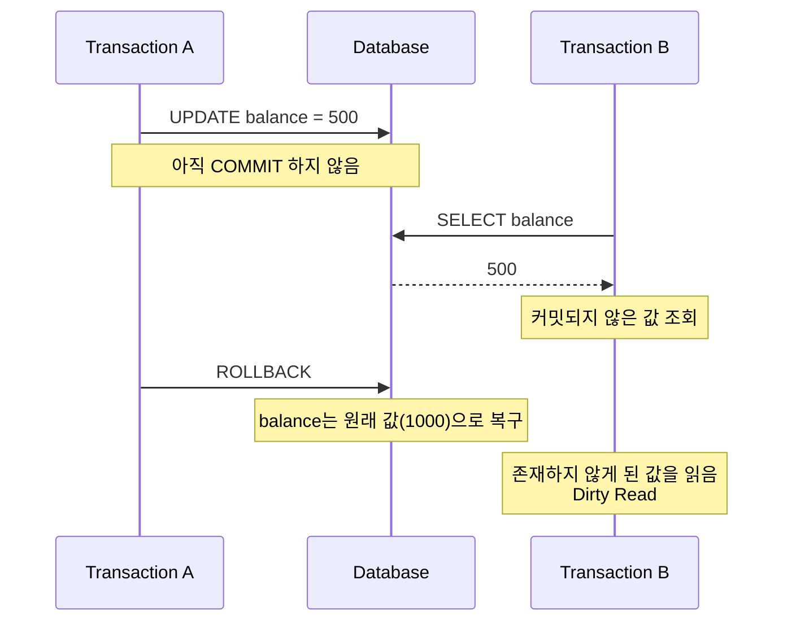
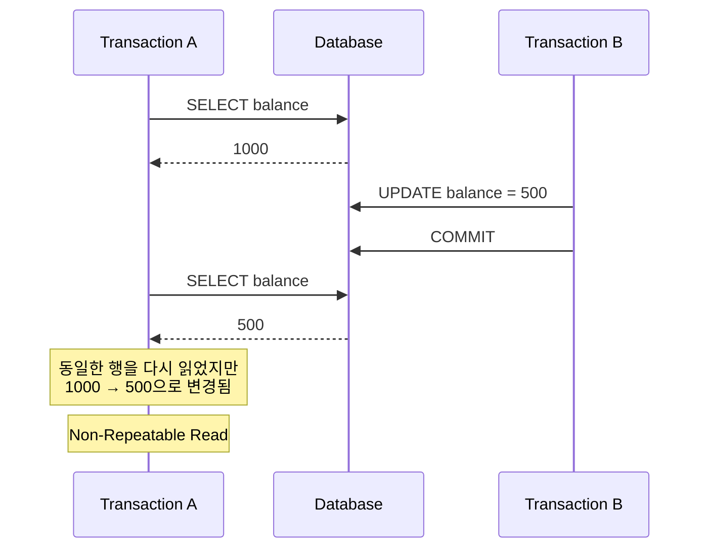
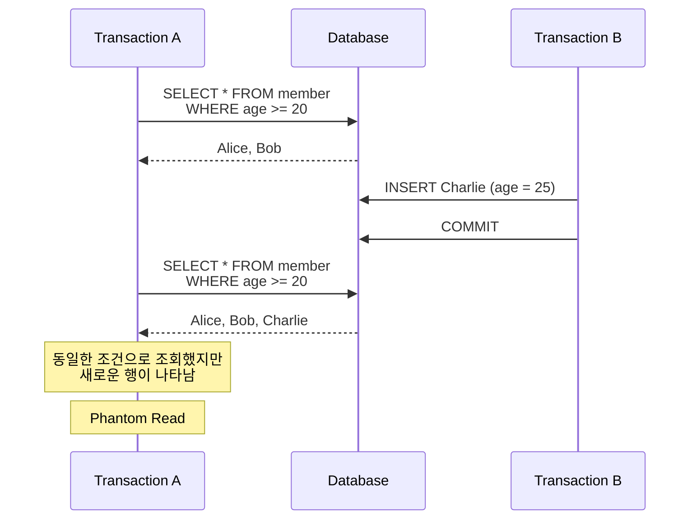
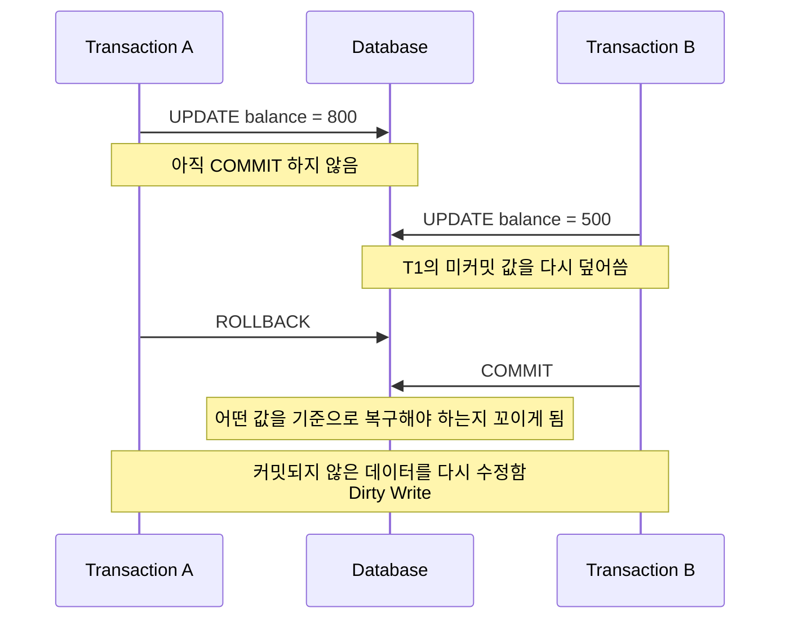
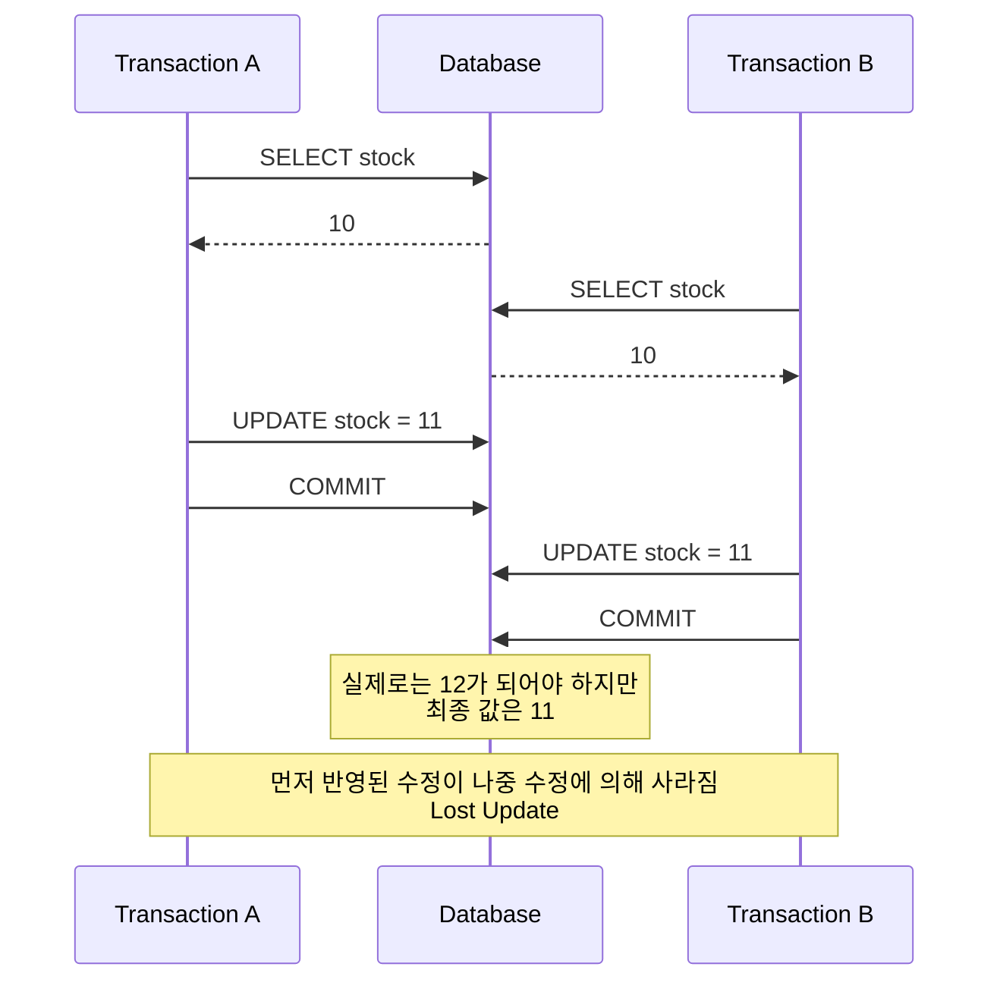
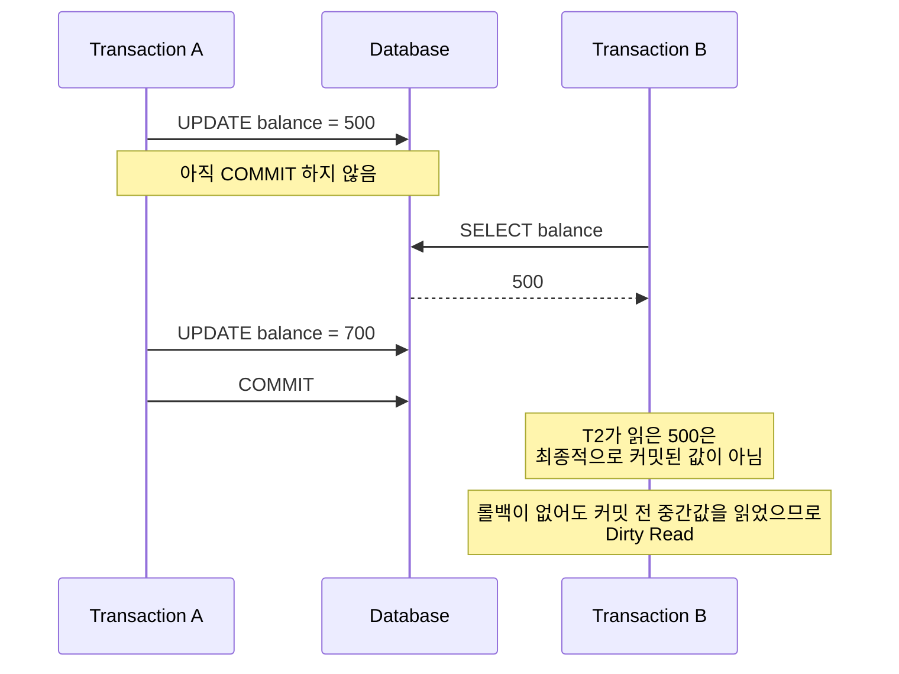
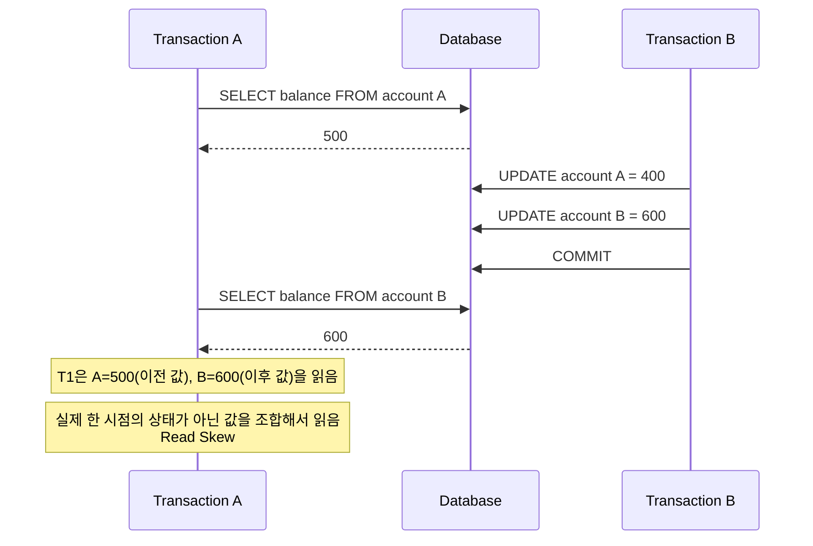
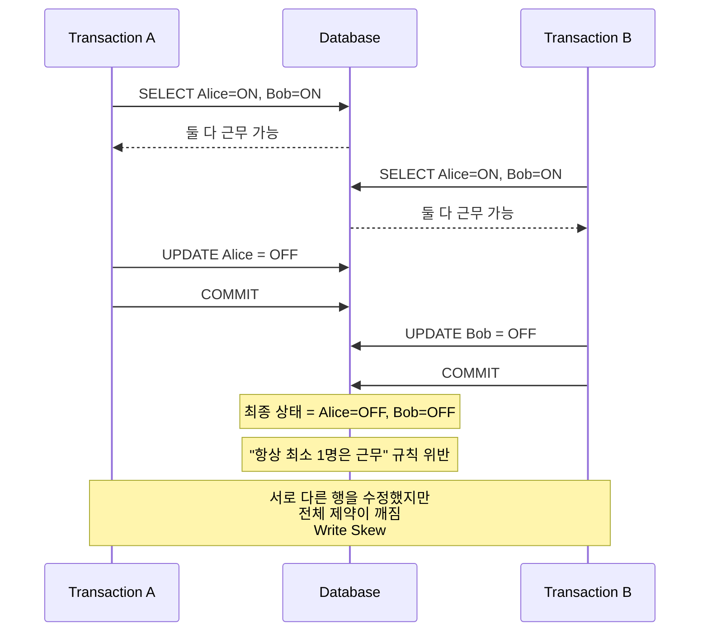
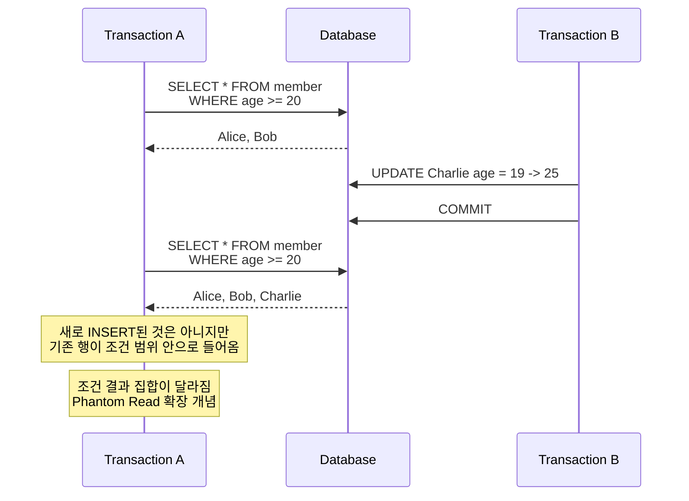

---
tags:
  - DB
aliases:
  - Anomaly
  - 이상 현상
---
트랜잭션 [[Isolation Level|격리 수준]]이 충분하지 않아 데이터 조회/수정 결과의 일관성이 깨지는 현상을 말한다.  

## Standard SQL 92

Strandard SQL 92에서 정의한 3가지의 이상 현상은 다음과 같다.  

- [[#Dirty Read]]
- [[#Non-Repeatable Read]]
- [[#Phantom Read]]

### Dirty Read

다른 트랜잭션이 커밋되지 않은 트랜잭션의 값을 읽었을 때 발생하는 현상이다.  

### Non-Repeatable Read

같은 트랜잭션에서 같은 행을 다시 읽었을 때 값이 달라지는 현상이다.  

> Fuzzy Read라고도 부른다.  

### Phantom Read

같은 범위 조건으로 다시 조회했을 때 행이 추가되거나 사라지는 현상이다.

## Standard SQL 92에 대한 비판

- 세 가지 이상 현상의 정의가 모호하다.
- 이상 현상은 세 가지 외에도 추가로 더 존재한다.
- 상업적인 DBMS에서 사용되는 방법을 반영해서 Isolation Level를 구분하지 않았다.  

### Dirty Write

커밋되지 않은 데이터를 write할때 발생하는 현상이다.  

> 일반적으로 모든 정상적인 DBMS는 Dirty Write를 허용하면 안 됨. 

### Lost Update

한 트랜잭션의 수정 결과가 다른 트랜잭션의 수정에 의해 덮어씌워져 사라지는 현상이다.  

### Dirty Read 확장 개념

롤백이 발생하지 않아도 Dirty Read는 발생할 수 있다.  
다른 트랜잭션의 커밋 전 데이터를 읽었다면, 나중에 그 트랜잭션이 커밋되더라도 Dirty Read하다.

### Read Skew

다른 트랜잭션이 데이터를 수정하여, 서로 다른 시점의 데이터를 읽게 되는 현상이다.  

### Write Skew

서로 다른 행을 읽고, 각각 다른 행을 수정하기 때문에 직접적인 충돌은 없어 보이지만,
결과적으로 전체 비즈니스 규칙이 깨지는 현상이다.

### Phantom Read 확장 개념

Phantom Read는 단순히 새 행이 INSERT되는 경우만이 아니라,
기존 행이 조건 범위에 들어오거나 빠져나가는 UPDATE / DELETE 때문에도 발생할 수 있다.

## 출처 및 참고자료

https://www.youtube.com/watch?v=bLLarZTrebU&t=410s  