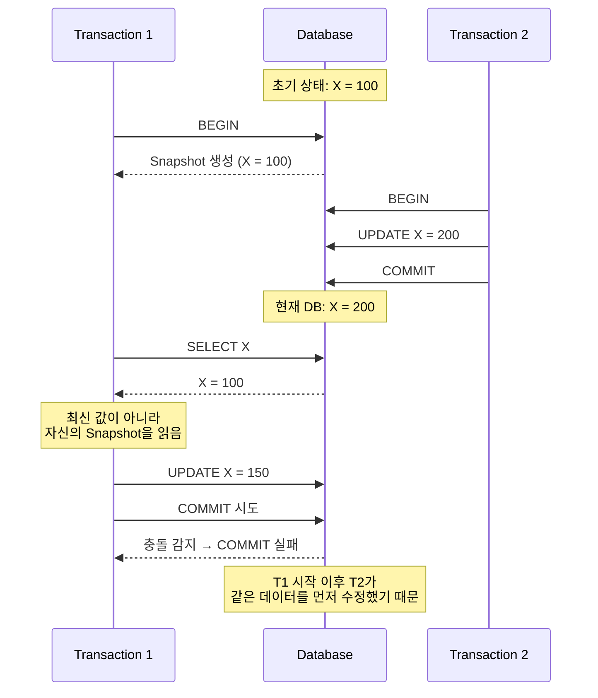

---
tags:
  - DB
---
## Snapshot Isolation

스냅샷 격리(Snapshot isolation)는 데이터베이스 및 [[Transaction|트랜잭션]] 처리에서 트랜잭션에서 수행된 모든 읽기가 데이터베이스의 일관된 스냅샷을 볼 수 있도록 보장한다(실제로는 시작 당시 존재했던 마지막 커밋된 값을 읽습니다). 트랜잭션 자체는 해당 스냅샷 이후 발생한 동시 업데이트와 충돌하는 업데이트가 없는 경우에만 성공적으로 커밋된다.

해당 방식은 Serializability 방식 보다 성능이 좋고 Serializability 방식이 방지하는 대부분의 동시성 이상 현상들을 방지하기 때문이다.   

## 동작 방식

세부적인 내용은 구현 방식에 따라 달라지며 아래 내용은 동작하는 흐름만을 이해하기 위한 모식도라고 생각하자.

## 출처 및 참고자료

https://ko.wikipedia.org/wiki/%EC%8A%A4%EB%83%85%EC%83%B7_%EA%B2%A9%EB%A6%AC  
https://www.youtube.com/watch?v=bLLarZTrebU&t