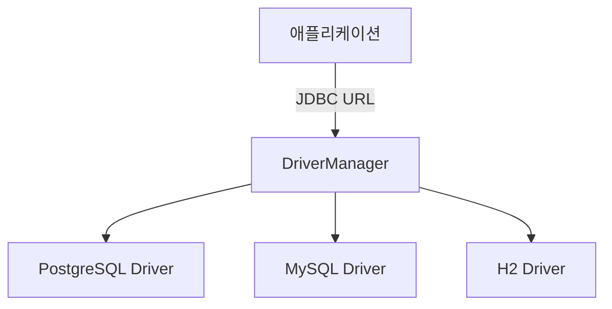

자바 언어를 통해 데이버베이스에 접근하는 표준 API  

- DB 변화가 프로덕션 코드의 변화를 주지 않는다.
- SQL Mapper, ORM은 내부적으로 JDBC API를 호출하여 데이터베이스를 사용한다.  

## 동작원리

1. `Driver`를 통해 데이터베이스에 연결한다.
2. `Driver`는 `DriverManager`를 통해 간접적으로 호출된다.
3. 데이터베이스에 연결 후 연결 관련 정보들을 `Connection`에 객체에 저장한다.  
4. `Connection` 객체에 원하는 SQL 쿼리를 넘겨주어 `Statement` 객체를 생성한다.
5. `Statement` 객체는 쿼리를 실행하여 쿼리에 대한 결과값인`ResultSet`을 반환한다.  

![[Pasted image 20260723205341.png|294]]

## 구성 요소

### Driver

데이터베이스와 연결할 때 사용된다.  

```
DriverManager -> Driver -> .connect() -> DB 연결
```

### DriverManager

`DriverManager`는 등록된 JDBC 드라이버들을 관리하고, JDBC URL을 기준으로 적절한 드라이버를 선택하여 `Connection` 생성을 위임하는 클래스다.



이를 통해 애플리케이션은 PostgreSQL, MySQL과 같은 구체적인 드라이버 구현체에 직접 의존하지 않고 표준 JDBC API만 사용할 수 있다.

Driver 클래스 로딩 시점에 DriverManager에 등록된다.  

```java
static {
    try {
      register();
    } catch (SQLException e) {
      throw new ExceptionInInitializerError(e);
    }
}

public static void register() throws SQLException {  
  if (isRegistered()) {  
    throw new IllegalStateException(  
        "Driver is already registered. It can only be registered once.");  
  }  
  Driver registeredDriver = new Driver();  
  DriverManager.registerDriver(registeredDriver);  
  Driver.registeredDriver = registeredDriver;  
}
```

### Connection

데이터베이스와의 연결(세션) 정보를 가진다.  

`DriverManager`가 DB에 연결 후 `Connection`정보를 가져온다.  

```java
// java.sql.DriverManager
private static Connection getConnection(
	String url, java.util.Properties info, Class<?> caller) throws SQLException {
}
```

```java
// java.sql.Driver;
Connection connect(String url, java.util.Properties info) throws SQLException;
```

`Connection`은 `commit()`, `rollback()`과 같이 DB 연결을 제어한다.  

```java
// java.sql.Connection
public interface Connection  extends Wrapper, AutoCloseable {
	void commit() throws SQLException;
	void rollback() throws SQLException;
}
```

> [!INFO]
> Spring에서는 `DataSource`를 통해 [[Connection-Pool|커넥션 풀]]에서 `Connection` 객체를 가져온다.  

%%  %%
### Statement

SQL을 데이터베이스에 전달하고 실행 결과를 받는 인터페이스

`Connection`이 `prepareStatment()`를 호출하여 `PrepareStateMent`를 생성한다.

```java
// java.sql.Connection
PreparedStatement prepareStatement(String sql) throws SQLException;
```

`Statement`와 이를 구현한 `PrepareStatment`가 있는데 차이점은 다음과 같다.  

| 구분                  | 생성 방법                              | SQL 전달           | 파라미터 바인딩                         |
| ------------------- | ---------------------------------- | ---------------- | -------------------------------- |
| `Statement`         | `connection.createStatement()`     | 실행할 때 SQL 문자열 전달 | 지원하지 않음                          |
| `PreparedStatement` | `connection.prepareStatement(sql)` | 생성할 때 SQL 구조 전달  | `setString()`, `setInt()` 등으로 지원 |

세더 메서드를 통해 `?` 위치에 타입 정보와 함께 값을 설정한다.  

```java
"SELECT * FROM member WHERE name = ?"
// statement.setString(1, "어진");
"SELECT * FROM member WHERE name = '어진'"
```

> [!INFO]
> `?`에는 테이블명이나 컬럼명 같은 SQL 문법 요소는 바인딩할 수 없다.  
> 사용자 입력을 SQL 문법이 아닌 파라미터 데이터로 취급하여 SQL Injection을 예방한다.  

%%  %%
### ResultSet

실행한 SQL 쿼리 결과를 가져올 때 사용한다.  

`Statement`가 `executeQuery()` 메서드를 실행하면 SQL 쿼리가 실행되고 SQL 쿼리 결과를 `ResultSet` 객체에 저장한다.   

```java
ResultSet executeQuery(String sql) throws SQLException;
```