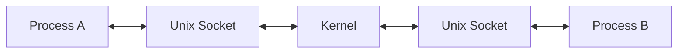

---
tags:
  - Network
aliases:
  - 소켓
---
Socket은 두 프로세스 사이에 **양방향 통신 채널을 제공하는 [[IPC]] 메커니즘**이다.

Socket의 중요한 특징은 동일한 컴퓨터뿐만 아니라 **네트워크를 통한 서로 다른 컴퓨터의 프로세스 간 통신까지 지원할 수 있다는 것**이다.


같은 컴퓨터 안에서만 통신한다면 Unix Domain Socket을 사용할 수 있다.



Linux에서는 Unix Domain Socket을 `AF_UNIX` 또는 `AF_LOCAL` Socket이라고 부른다.

Unix Domain Socket은 동일한 컴퓨터 내 프로세스 간 통신을 위해 만들어졌으며 다음과 같은 형태를 지원한다.

- `SOCK_STREAM`
- `SOCK_DGRAM`
- `SOCK_SEQPACKET`

Network Socket을 사용한다면 TCP/IP 등을 통해 다른 컴퓨터의 프로세스와도 통신할 수 있다.  
따라서 Socket은 IPC뿐 아니라 분산 시스템의 프로세스 간 통신에서도 핵심적으로 사용된다.


## 출처 및 참고자료

```cardlink
url: https://www.youtube.com/watch?v=WwseO8l8rZc&list=PLcXyemr8ZeoSGlzhlw4gmpNGicIL4kMcX&index=5
title: "BJ.58-2 (실제편) 표준 스펙에서 정의된 개념과 차이가 있는 실제 소켓(Socket), 포트(Port) 개념을 소개합니다! 특히 소켓 식별 방식을 유심히 봐주세요!"
description: "#socket #programming #네트워크 #쉬운코드 #백발백중 1부 영상에서는 프로토콜 표준에서 정의된 소켓(socket)과 포트(port), TCP 커넥션(connection)의 개념을 살펴봤습니다그런데 실제로는 이 표준대로 100% 일치하게 구현되고 또 동작하지 않습니다..."
host: www.youtube.com
favicon: https://www.youtube.com/s/desktop/3a93864d/img/favicon_32x32.png
image: https://i.ytimg.com/vi/WwseO8l8rZc/maxresdefault.jpg
```
