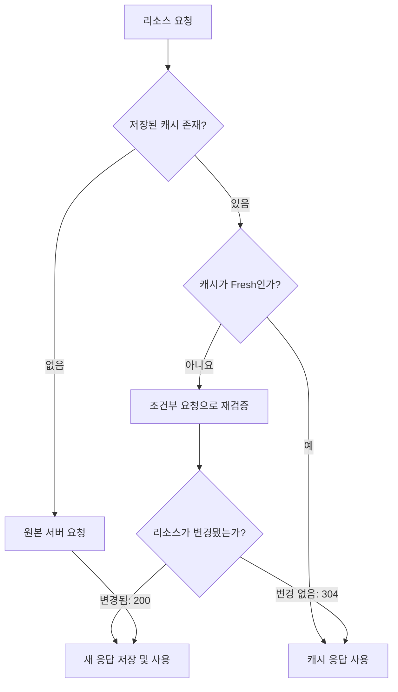

# HTTP Cache

웹 캐시가 자신의 저장소 내에 요청된 리소스를 가지고 있다면, 요청을 가로채 Origin 서버로부터 리소스를 다시 다운로드하는 대신 리소스의 복사본을 반환한다.  

HTTP 캐시들은 일반적으로 `GET`에 대한 응답만을 캐싱한다.  

캐시 저장소에 해당 요청 리소스가 이미 있다면 재요청시 헤더값만 응답 받는다.  

![[Pasted image 20260713223837.png]]  

- 개발자 도구에서 확인하자면 `Status`가 흐리게 표시된 요청들은 캐싱된 요청들이다.  
- `Size`에 `(memory cache)`라고 명시되어 있다.  

## 개인 캐시 (Private Cache)

응답 메시지를 로컬에 저장하는 저장소이며, 캐시에 저장된 메시지의 저장, 검색 및 삭제를 제어하는 ​​하위 시스템이다. 캐시는 캐시 가능한 응답을 저장하여 향후 동일한 요청에 대한 응답 시간과 네트워크 대역폭 소비를 줄인다.  

## 공유 캐시 (Public Cache)

대표적으로 **프록시 캐시**를 말한다. 여러 사용자가 재사용할 수 있도록 응답을 저장하는 캐시이다. 중간에 위치한 프록시 서버에 리소스를 두고 자주 요청되는 리소스를 프록시 서버에서 캐싱하여 동일한 리소스에 대한 여러 클라이언트의 요청에 대응한다.  

## 지시어

| 지시어               | 의미                            |
| ----------------- | ----------------------------- |
| `max-age=3600`    | 지정한 시간 동안 응답을 신선한 것으로 취급      |
| `s-maxage=3600`   | CDN이나 프록시 같은 공유 캐시에 적용되는 유효기간 |
| `no-cache`        | 저장은 가능하지만 사용할 때마다 서버 재검증 필요   |
| `no-store`        | 응답을 캐시에 저장하지 않음               |
| `private`         | 브라우저 같은 개인 캐시에만 저장 가능         |
| `public`          | 공유 캐시에도 저장할 수 있음을 명시          |
| `must-revalidate` | 응답이 오래되면 서버 검증 없이 사용하지 못하게 함  |

## 동작 원리

1. 클라이언트가 리소스를 요청한다
2. 서버가 캐시 정책과 함께 응답한다
3. 동일한 리소스를 다시 요청한다
4. 캐시가 아직 신선하면 바로 사용하고 캐시가 오래되었다면 서버에 재검증을 요청한다
5. 서버가 변경 여부에 따라 응답한다

- 참고: `304 Not Modified`

## 출처 및 참고자료

https://developer.mozilla.org/ko/docs/Web/HTTP/Guides/Caching  
https://coding-factory.tistory.com/1011  