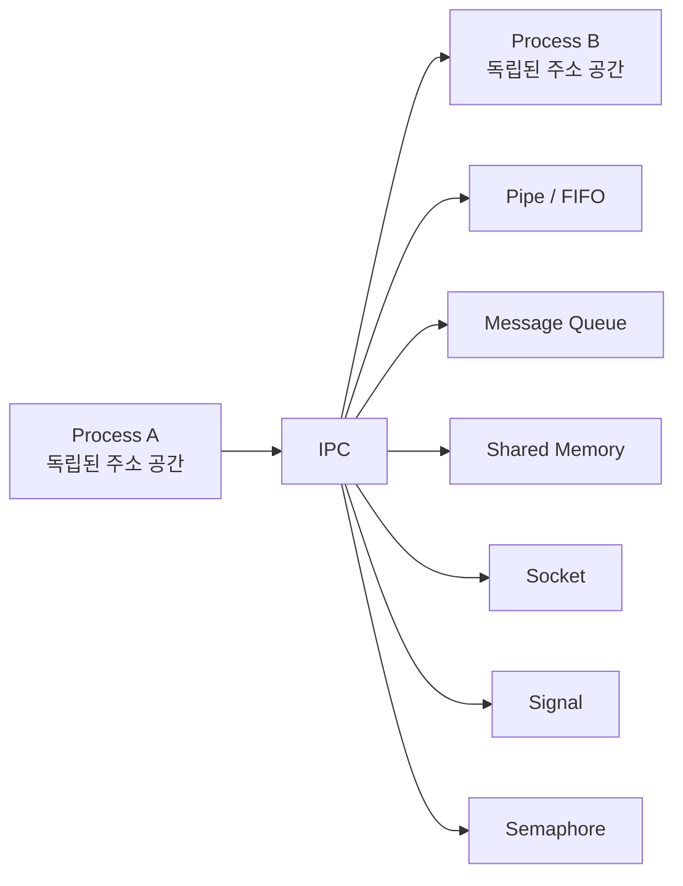
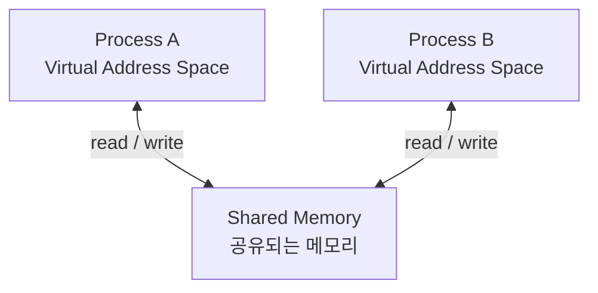
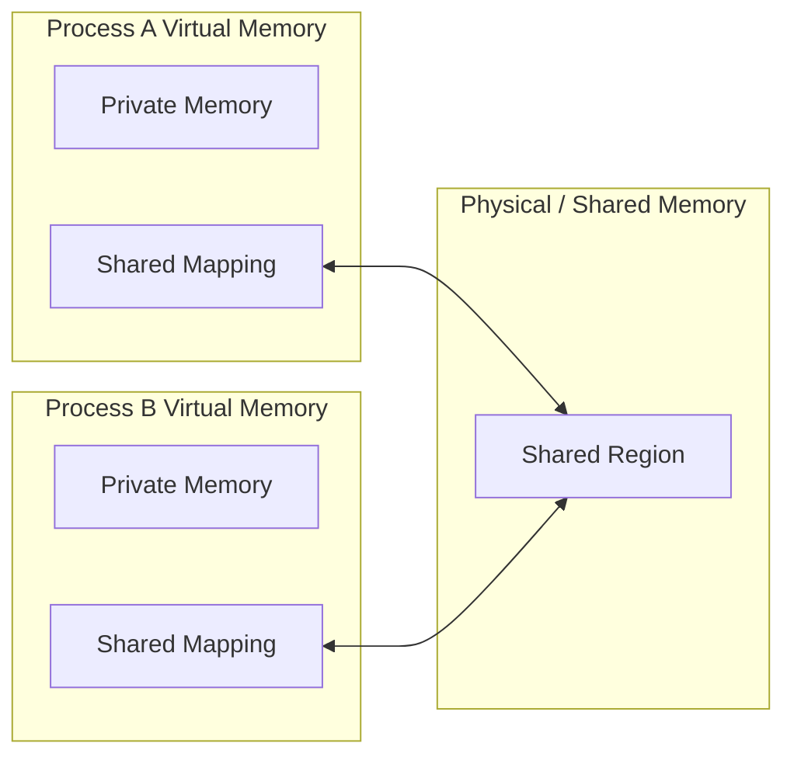
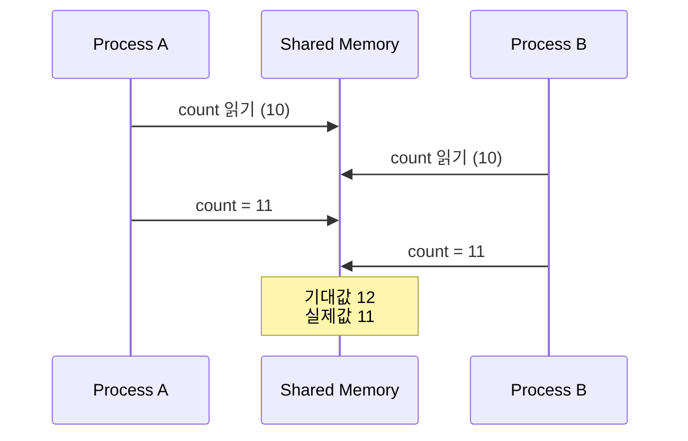
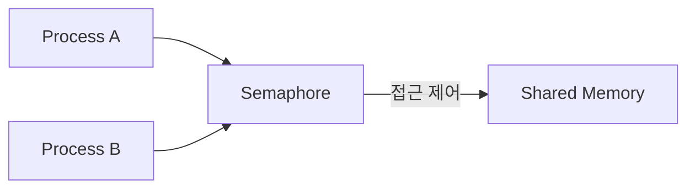
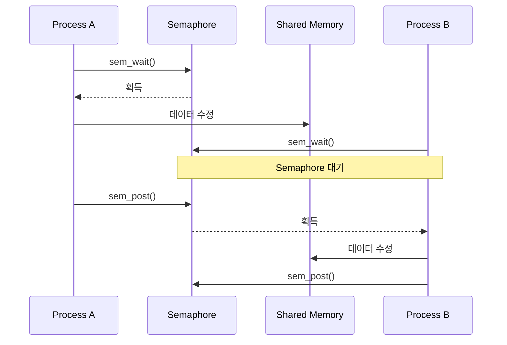
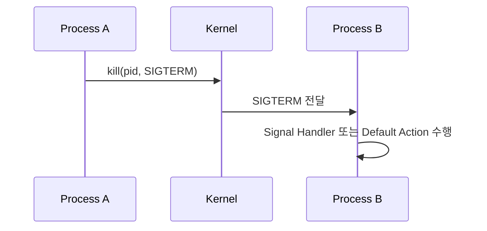
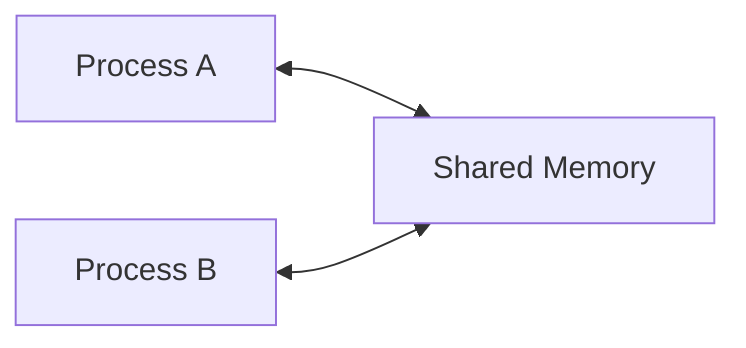
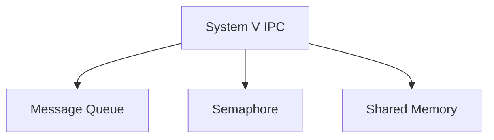
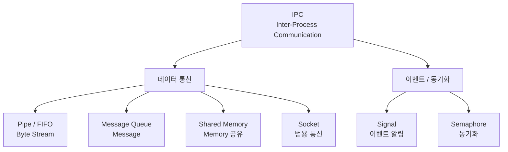

---
tags:
  - OS
  - Network
aliases:
  - IPC
  - 프로세스 간 통신
---
> [!CAUTION]
> 해당 내용은 AI를 활용하여 작성했습니다.  

# IPC (Inter-Process Communication)

IPC(Inter-Process Communication)는 **서로 독립적으로 실행되는 프로세스가 데이터를 주고받거나 실행 순서를 동기화하기 위해 운영체제가 제공하는 통신 메커니즘**을 의미한다.

프로세스는 각각 독립된 가상 주소 공간을 사용하기 때문에 한 프로세스가 다른 프로세스의 메모리에 일반적인 방법으로 직접 접근할 수 없다.

따라서 서로 다른 프로세스가 협력해야 하는 경우 운영체제가 제공하는 IPC 메커니즘을 사용한다.

예를 들어 다음과 같은 상황에서 IPC가 필요하다.

- Shell에서 여러 명령어를 연결하는 경우
    
- 부모 프로세스와 자식 프로세스가 데이터를 교환하는 경우
    
- 여러 프로세스가 동일한 데이터를 공유하는 경우
    
- 클라이언트 프로세스와 서버 프로세스가 통신하는 경우
    
- 다른 프로세스에게 특정 이벤트가 발생했음을 알리는 경우
    



IPC는 크게 생각하면 **메시지를 전달하는 방식(Message Passing)**과 **메모리를 공유하는 방식(Shared Memory)**으로 나눠 이해할 수 있다.

Signal과 Semaphore는 조금 성격이 다르다.

- **Signal** : 이벤트나 상태 변화를 알리는 용도
    
- **Semaphore** : 프로세스 간 실행 순서 및 공유 자원 접근을 동기화하는 용도
    

---

## Message Passing

Message Passing 방식에서는 프로세스들이 서로의 메모리를 직접 공유하지 않고 **운영체제가 제공하는 통신 통로를 통해 데이터를 전달한다.**

대표적으로 다음과 같은 방식이 있다.

- Pipe
    
- FIFO
    
- Message Queue
    
- Socket
    

일반적인 구조는 다음과 같다.


Process A가 데이터를 커널에게 전달하고 Process B가 커널로부터 데이터를 전달받는다.

따라서 프로세스들이 하나의 메모리를 직접 공유하는 Shared Memory와 구조적으로 차이가 있다.

---

# Pipe

Pipe는 프로세스 간에 데이터를 전달할 수 있는 **단방향 Byte Stream 통신 채널**이다.

Linux에서 `pipe()`를 호출하면 운영체제는 하나의 Pipe를 만들고 두 개의 File Descriptor를 반환한다.

- Read End
    
- Write End
    


Process A가 Write End에 데이터를 쓰면 커널의 Pipe Buffer에 데이터가 저장되고 Process B가 Read End를 통해 데이터를 읽는다.

Pipe의 데이터는 **Byte Stream**이므로 메시지 단위의 경계가 존재하지 않는다.

예를 들어

```text
write("Hello")
write("World")
```

와 같이 두 번 데이터를 쓰더라도 읽는 쪽에서 반드시 `"Hello"`, `"World"`라는 두 개의 메시지로 구분해서 받는 것이 보장되지는 않는다.

### 특징

- 기본적으로 단방향 통신
    
- 양방향 통신이 필요하면 일반적으로 Pipe 두 개가 필요
    
- Byte Stream 기반
    
- 커널이 데이터를 중계
    
- 보통 부모-자식처럼 관계가 있는 프로세스 사이에서 사용
    

대표적인 예시는 Shell의 `|` 연산자이다.

```bash
ls | grep ".txt"
```

개념적으로는 다음과 같다.


`ls`의 출력이 Pipe를 통해 `grep`의 입력으로 전달된다.

---

# FIFO (Named Pipe)

일반 Pipe는 통신할 프로세스들이 Pipe의 File Descriptor를 공유할 수 있어야 하므로 주로 관련된 프로세스 사이에서 사용한다.

FIFO는 이러한 Pipe에 **파일 시스템상의 이름을 부여한 것**이다.

따라서 서로 관련이 없는 프로세스들도 같은 FIFO 경로를 열어서 통신할 수 있다.


중요한 것은 FIFO의 파일 경로에 실제 데이터가 저장되는 것은 아니라는 것이다.

파일 시스템의 FIFO 항목은 프로세스들이 동일한 Pipe를 찾기 위한 **이름 역할**을 하고 실제 데이터 전달은 커널 내부에서 이루어진다.

### Pipe와 FIFO

|구분|Pipe|FIFO|
|---|---|---|
|다른 이름|Anonymous Pipe|Named Pipe|
|파일 시스템 이름|없음|있음|
|관련 없는 프로세스 간 통신|상대적으로 어려움|가능|
|데이터 형태|Byte Stream|Byte Stream|
|데이터 전달|Kernel|Kernel|

---

# Message Queue

Message Queue는 운영체제가 관리하는 Queue를 이용하여 **메시지 단위로 데이터를 전달하는 IPC 방식**이다.


Pipe와 중요한 차이점은 **메시지의 경계가 존재한다는 것**이다.

Pipe가 단순한 Byte Stream이라면 Message Queue는 데이터를 각각의 Message 단위로 관리한다.

예를 들어

```text
Message 1 = "Hello"
Message 2 = "World"
```

처럼 각각 독립된 메시지로 전달할 수 있다.

POSIX Message Queue에서는 메시지에 **우선순위(priority)**를 지정하는 것도 가능하다.

### 특징

- 메시지 단위 통신
    
- 운영체제가 Queue를 관리
    
- 송신 프로세스와 수신 프로세스가 동시에 실행되고 있을 필요가 없는 구조를 만들 수 있음
    
- POSIX Message Queue는 메시지 우선순위를 지원
    
- Queue의 용량 등 커널 자원 제한을 고려해야 함
    

Linux에는 크게 두 종류의 Message Queue API가 존재한다.

```text
System V Message Queue
POSIX Message Queue
```

---

# Shared Memory

Shared Memory는 여러 프로세스가 **동일한 메모리 영역을 자신의 가상 주소 공간에 매핑하여 데이터를 공유하는 방식**이다.



각 프로세스의 가상 주소 공간 자체가 하나로 합쳐지는 것은 아니다.

대신 특정 영역이 동일한 Shared Memory Object를 참조하도록 매핑된다.

개념적으로 다음과 같다.



Process A가 공유 메모리의 값을 변경하면 Process B 역시 동일한 공유 영역을 통해 그 데이터를 확인할 수 있다.

Message Passing 방식과 달리 매번 데이터를 다른 프로세스로 전달하기 위해 커널의 IPC 버퍼를 거치는 형태가 아니므로 **대량의 데이터를 빈번하게 교환할 때 효율적인 방식이 될 수 있다.**

Linux의 POSIX Shared Memory에서는 대표적으로 다음 API가 사용된다.

```text
shm_open()
    ↓
ftruncate()
    ↓
mmap()
    ↓
Shared Memory 접근
```

하지만 중요한 문제가 하나 있다.

## Shared Memory의 동기화 문제

두 프로세스가 동일한 메모리에 동시에 접근할 수 있으므로 Race Condition이 발생할 수 있다.



따라서 Shared Memory를 사용할 때는 일반적으로 별도의 동기화 수단이 필요하다.

대표적으로 Semaphore가 사용될 수 있다.



즉,

> **Shared Memory는 데이터를 공유하고, Semaphore는 그 공유 데이터에 대한 접근을 조정한다.**

라는 관계로 이해할 수 있다.

---

# Semaphore

Semaphore는 프로세스가 데이터를 주고받기 위한 메커니즘이라기보다 **여러 프로세스 또는 스레드의 실행을 동기화하기 위한 메커니즘**이다.

Semaphore는 0보다 작아지지 않는 정수 값을 가지며 대표적으로 다음 연산이 존재한다.

```text
wait
post
```

POSIX 기준으로는 다음 API에 대응한다.

```text
sem_wait()
sem_post()
```

Semaphore 값이 0인 상태에서 `sem_wait()`를 호출하면 해당 실행 주체는 Semaphore 값이 증가할 때까지 대기한다.

예를 들어 Shared Memory를 한 프로세스만 수정하도록 만들 수 있다.



Linux에서는 POSIX Semaphore와 System V Semaphore가 모두 제공된다.

POSIX Semaphore에는 다시 다음 두 종류가 있다.

- Named Semaphore
    
- Unnamed Semaphore
    

서로 다른 프로세스에서 Unnamed Semaphore를 공유하려면 Semaphore 자체가 Shared Memory와 같이 프로세스들이 공유할 수 있는 메모리 영역에 위치해야 한다.

---

# Signal

Signal은 프로세스에게 **특정 이벤트가 발생했음을 비동기적으로 알리는 메커니즘**이다.

Linux에서는 `kill()` 등의 시스템 콜을 사용하여 다른 프로세스에게 Signal을 보낼 수 있다.



대표적인 Signal에는 다음과 같은 것들이 있다.

```text
SIGTERM
SIGINT
SIGKILL
SIGCHLD
SIGSTOP
```

Signal의 핵심 목적은 일반적인 데이터 전송보다는 **상태나 이벤트를 상대 프로세스에게 알리는 것**에 가깝다.

예를 들어 부모 프로세스는 `SIGCHLD`를 통해 자식 프로세스의 상태 변화가 발생했음을 알 수 있다.

따라서 큰 데이터를 주고받는 용도로 Signal을 사용하는 것은 적절하지 않다.

---

# Socket

Socket은 두 프로세스 사이에 **양방향 통신 채널을 제공하는 IPC 메커니즘**이다.

Socket의 중요한 특징은 동일한 컴퓨터뿐만 아니라 **네트워크를 통한 서로 다른 컴퓨터의 프로세스 간 통신까지 지원할 수 있다는 것**이다.


같은 컴퓨터 안에서만 통신한다면 Unix Domain Socket을 사용할 수 있다.


Linux에서는 Unix Domain Socket을 `AF_UNIX` 또는 `AF_LOCAL` Socket이라고 부른다.

Unix Domain Socket은 동일한 컴퓨터 내 프로세스 간 통신을 위해 만들어졌으며 다음과 같은 형태를 지원한다.

- `SOCK_STREAM`
    
- `SOCK_DGRAM`
    
- `SOCK_SEQPACKET`
    

Network Socket을 사용한다면 TCP/IP 등을 통해 다른 컴퓨터의 프로세스와도 통신할 수 있다.

따라서 Socket은 IPC뿐 아니라 분산 시스템의 프로세스 간 통신에서도 핵심적으로 사용된다.

---

# IPC 방식 비교

|IPC|데이터 전달|메시지 경계|주요 용도|특징|
|---|---|---|---|---|
|Pipe|Byte Stream|X|관련 프로세스 간 단순 데이터 전달|단방향|
|FIFO|Byte Stream|X|관련 없는 로컬 프로세스 간 통신|파일 시스템 이름 존재|
|Message Queue|Message|O|메시지 단위 비동기 통신|Kernel Queue 사용|
|Shared Memory|Memory|직접 정의|대량 데이터 공유|별도 동기화 필요|
|Semaphore|전달 목적 아님|-|동기화|공유 자원 접근 제어|
|Signal|작은 이벤트 정보|Signal 단위|이벤트 알림|비동기적|
|Socket|Stream / Datagram 등|방식에 따라 다름|범용 양방향 통신|로컬 및 네트워크 통신 가능|

---

# Message Passing vs Shared Memory

IPC를 이해할 때 가장 중요한 차이 중 하나이다.

## Message Passing


운영체제가 프로세스 사이에서 데이터를 중계한다.

대표적인 방식은 다음과 같다.

- Pipe
    
- Message Queue
    
- Socket
    

장점은 각 프로세스의 메모리 독립성을 그대로 유지하면서 비교적 명확한 통신 구조를 만들 수 있다는 것이다.

반면 데이터가 통신 메커니즘을 통해 전달되어야 하기 때문에 큰 데이터를 매우 빈번하게 교환하는 상황에서는 비용이 커질 수 있다.

## Shared Memory



두 프로세스가 같은 메모리 영역을 공유한다.

메모리 영역이 설정된 이후에는 데이터를 매번 Pipe나 Message Queue를 통해 전달할 필요 없이 공유 영역을 직접 읽고 쓸 수 있다.

따라서 많은 데이터를 빠르게 공유하기에 유리할 수 있다.

하지만 동시에 접근할 수 있기 때문에 다음과 같은 동기화 문제가 발생할 수 있다.

- Race Condition
    
- 데이터 일관성 문제
    
- 실행 순서 문제
    

따라서 Mutex, Semaphore 등의 동기화 기법이 함께 필요할 수 있다.

---

# Linux의 IPC

Linux에서는 역사적인 이유로 여러 세대의 IPC API가 함께 제공된다.

대표적으로 System V IPC에는 세 가지가 있다.



System V IPC는 UNIX 시스템에서 오래전부터 사용된 IPC 인터페이스이다.

Linux는 이와 함께 POSIX에서 정의한 다음 인터페이스들도 지원한다.

- POSIX Message Queue
    
- POSIX Semaphore
    
- POSIX Shared Memory
    

따라서 Linux 문서를 보면 다음처럼 비슷한 이름의 IPC가 두 종류 존재할 수 있다.

```text
System V Shared Memory
POSIX Shared Memory

System V Semaphore
POSIX Semaphore

System V Message Queue
POSIX Message Queue
```

처음 IPC를 공부할 때는 API 차이를 먼저 외우기보다

```text
Pipe          → Byte Stream 전달
Message Queue → Message 전달
Shared Memory → 메모리 공유
Semaphore     → 동기화
Signal        → 이벤트 전달
Socket        → 범용 양방향 통신
```

정도로 **각 메커니즘의 역할을 구분하는 것이 중요하다.**

---

# 정리

IPC가 필요한 근본적인 이유는 **프로세스들이 서로 독립된 주소 공간에서 실행되기 때문**이다.

프로세스들이 협력하기 위해서는 운영체제가 제공하는 방법을 이용해 데이터를 전달하거나 공유하고 실행을 동기화해야 한다.

IPC를 공부할 때는 다음 구조를 중심으로 기억하면 된다.



특히 다음 세 가지 차이를 이해하는 것이 핵심이다.

> **Pipe는 데이터를 흐르게 한다.**  
> **Shared Memory는 메모리 자체를 공유한다.**  
> **Semaphore는 공유 자원에 접근하는 순서를 조정한다.**

그리고 Socket은 보다 범용적인 양방향 통신을 제공하며, 같은 시스템뿐 아니라 네트워크상의 다른 시스템까지 통신 범위를 확장할 수 있다.

---

# 출처 및 참고자료

- [Linux man-pages —](https://man7.org/linux/man-pages/man7/pipe.7.html) `[pipe(7)](https://man7.org/linux/man-pages/man7/pipe.7.html)`: Pipe와 FIFO의 단방향 Byte Stream 및 동작 방식
- [Linux man-pages —](https://man7.org/linux/man-pages/man7/fifo.7.html) `[fifo(7)](https://man7.org/linux/man-pages/man7/fifo.7.html)`: Named Pipe와 파일 시스템 이름의 역할
- [Linux man-pages —](https://man7.org/linux/man-pages/man7/shm_overview.7.html) `[shm_overview(7)](https://man7.org/linux/man-pages/man7/shm_overview.7.html)`: POSIX Shared Memory의 구조와 동기화 필요성
- [Linux man-pages —](https://man7.org/linux/man-pages/man7/mq_overview.7.html) `[mq_overview(7)](https://man7.org/linux/man-pages/man7/mq_overview.7.html)`: POSIX Message Queue와 메시지 단위 데이터 교환
- [Linux man-pages —](https://man7.org/linux/man-pages/man7/sem_overview.7.html) `[sem_overview(7)](https://man7.org/linux/man-pages/man7/sem_overview.7.html)`: POSIX Semaphore와 `sem_wait()`, `sem_post()` 동작
- [Linux man-pages —](https://man7.org/linux/man-pages/man7/unix.7.html) `[unix(7)](https://man7.org/linux/man-pages/man7/unix.7.html)`: Unix Domain Socket을 이용한 로컬 프로세스 간 통신
- [Linux man-pages —](https://man7.org/linux/man-pages/man7/signal.7.html) `[signal(7)](https://man7.org/linux/man-pages/man7/signal.7.html)`: Linux Signal의 전달과 처리 방식
- [Linux man-pages —](https://man7.org/linux/man-pages/man7/svipc.7.html) `[sysvipc(7)](https://man7.org/linux/man-pages/man7/svipc.7.html)`: System V Message Queue, Semaphore, Shared Memory