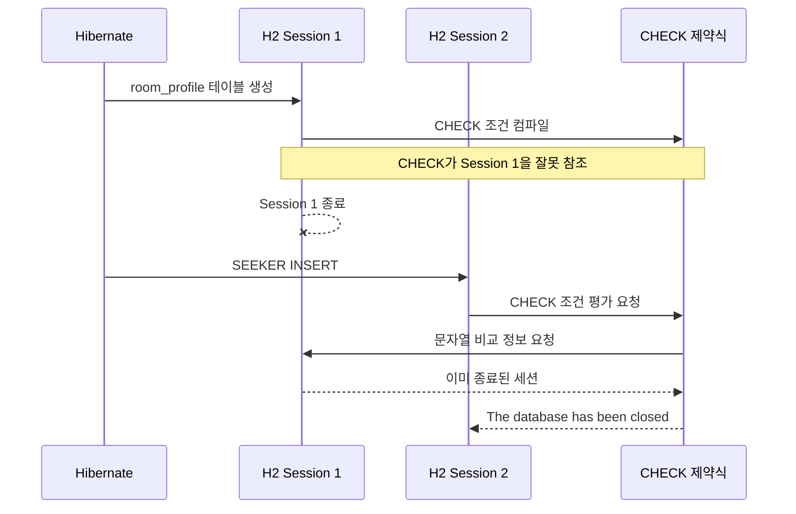

## 관련 PR

https://github.com/prography/11th-1team-BE/pull/196

## 개요

H2 관련해서 이슈가 발생했다.  

![[Pasted image 20260723211729.png|430]]

결론적으로 아래와 같은 버전으로 고정히여 문제를 해결할 수 있다.

```groovy
runtimeOnly 'com.h2database:h2:2.3.232'
```

원인과 해결 방법은 이미 블로그와 공식 저장소에서도 확인할 수 있지만 어떤 문제로 인해 발생하는지 알아보고자 한다. 

## 원인

최신 버전인 H2 2.4.240은 CHECK 제약식을 생성한 세션이 닫힌 뒤 다른 **세션**에서 INSERT하면, 제약식이 이전 **세션**을 참조하면서 동일한 예외를 발생시킬 수 있다고 한다.  

> [!INFO]
> 여기서 말하는 세션은 H2가 관리하는 DB 세션 구현체인 `SessionLocal`를 말한다.

애플리케이션이 DB의 물리적인 [[JDBC#Connection|Connection]]을 만들면 데이터베이스 내부에는 보통 그 연결을 담당하는 세션이 만들어진다.  

```
JDBC Connection 1 ──> H2 Session 1
JDBC Connection 2 ──> H2 Session 2
JDBC Connection 3 ──> H2 Session 3
```

즉, `CHECK` 제약식을 `Connection 1`이 만든 후 해당 커넥션을 닫는다.  
이후 `Connection 2`가 해당 테이블에 데이터를 INSERT할 때 문제가 발생한다는 것이다.  

정상적인 구현이라면 나중에 어떤 세션에서 INSERT하더라도 `Session 1`이 만든 `CHECK` 제약 조건을 알아야 한다. 그러나 latest 버전인 H2 2.4.240에는 현재 내부적으로 잘못된 참조를 하는 버그가 있어 다음과 같이 이미 종료된 세션에게 요청을 하게 되면서 에러가 발생하는 것이다.  



## 테스트

단순 테스트는 보통 다음처럼 같은 Connection 또는 아직 살아 있는 Connection을 사용한다.  

```
Connection 1로 테이블 생성
→ Connection 1이 계속 살아 있음
→ INSERT
→ 성공
```

그렇기에 이와 같은 문제가 다시 발현하는지 테스트하기 위해서는 DDL를 실행한 세션을 종료시키고 데이터 INSERT는 별개의 세션에서 실행시켜야 한다.  

DB URL은 아래와 같이 설정한다.  

```java
String URL = "jdbc:h2:mem:h2_check_constraint_regression;DB_CLOSE_DELAY=-1";
```

H2 인메모리 DB는 일반적으로 마지막 Connection이 닫히면 데이터베이스 자체가 사라지기에 `DB_CLOSE_DELAY=-1` 옵션을 주어 데이터베이스가 JVM이 종료되기 전까지 살아있도록 설정한다.

> 더 다양한 옵션은 [해당 글](https://www.baeldung.com/spring-boot-h2-database#h2-database-url-options)을 참고

세션에 대한 제어는 [[JDBC#DriverManager|DriverManager]]에서 직접 `getConncetion`을 호출하여 별개의 커넥션 객체를 만든 후 각각의 sql 쿼리문을 실행시킨다. 

```java
@Test  
@DisplayName("제약식을 생성한 세션이 닫혀도 다른 세션에서 허용된 discriminator를 저장한다")  
void insertAllowedDiscriminatorFromDifferentSession() throws Exception {  
    try (Connection schemaConnection = DriverManager.getConnection(URL, "sa", "");  
         var statement = schemaConnection.createStatement()) {  
        statement.execute(ddlSql);  
    }  
  
    assertDoesNotThrow(() -> {  
        try (Connection insertConnection = DriverManager.getConnection(URL, "sa", "");  
             var statement = insertConnection.prepareStatement(insertSql)) {  
            assertEquals(1, statement.executeUpdate());  
        }  
    });  
}
```

정상적으로 동작하는걸 확인할 수 있다.

![[Pasted image 20260723213954.png]]

## 출처 및 참고자료

https://jaehee1007.tistory.com/239  
https://github.com/h2database/h2database/issues/4291  
https://www.baeldung.com/spring-boot-h2-database#h2-database-url-options  