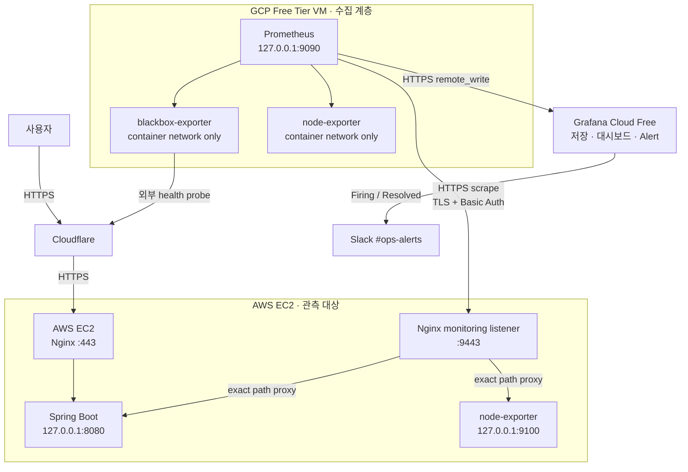
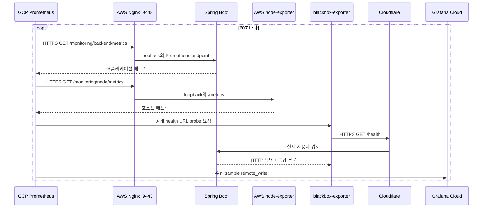
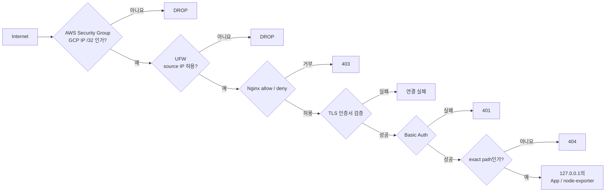
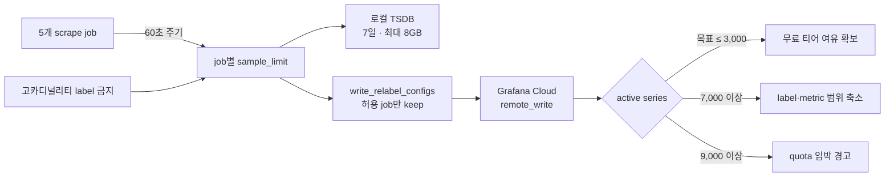
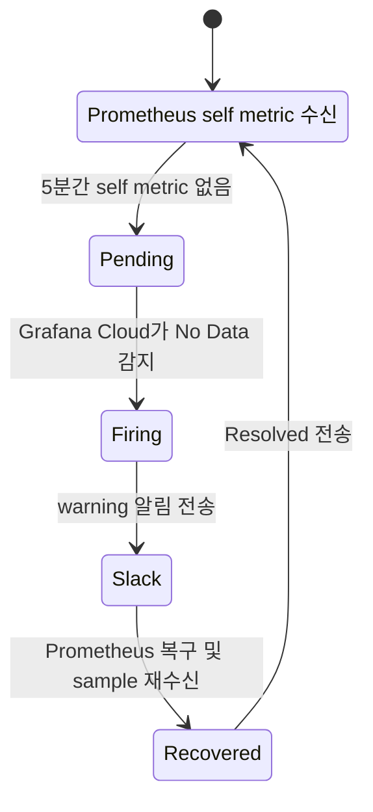
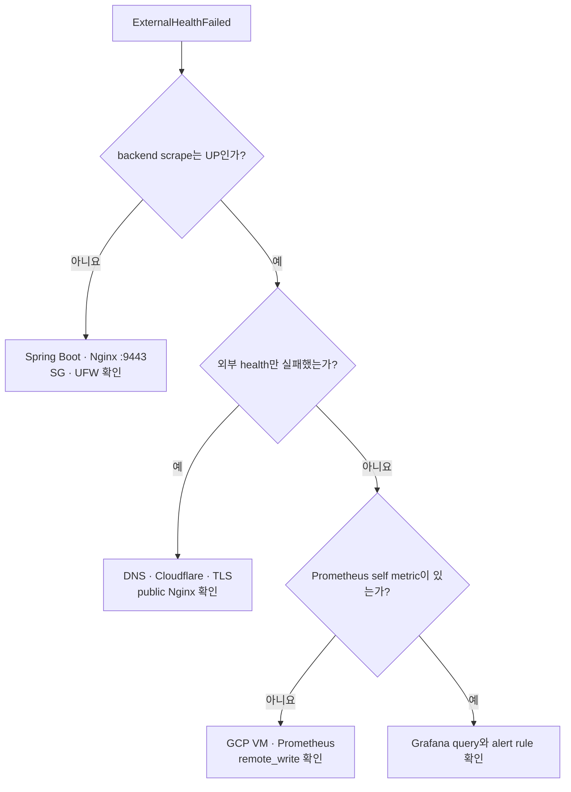

# 거의 무료로 프로덕션 모니터링 구축하기

작은 서비스에도 모니터링은 필요하다. 사용자가 “서비스가 안 된다”고 알려온 뒤에야 장애를 발견하고 싶지는 않기 때문이다. 하지만 모니터링을 위해 운영 서버와 비슷한 비용의 서버를 하나 더 두거나, 처음부터 복잡한 관측성 플랫폼을 운영하는 것도 MVP에는 과하다.

그래서 맛추리에서는 역할을 다음처럼 나눴다.

- GCP Free Tier VM은 메트릭을 **수집**한다.
- Grafana Cloud Free는 메트릭을 **보관·시각화하고 알림을 평가**한다.
- 기존 AWS EC2는 애플리케이션과 호스트 메트릭을 **외부에 최소한으로 제공**한다.
- Slack은 장애의 `Firing`과 복구의 `Resolved`를 전달한다.

이 글에서 말하는 “무료”는 엄밀히 말해 **증분 비용을 최대한 낮춘다**는 뜻이다. 2026년 7월 기준 GCP의 무료 `e2-micro` VM은 지정된 미국 리전에서만 제공되며, 고정 외부 IPv4와 네트워크 전송에는 별도 비용이 발생할 수 있다. 실제로는 월 몇 달러 수준의 비용이 생길 수 있으므로 [Google Cloud Free Tier](https://docs.cloud.google.com/free/docs/free-cloud-features#compute)와 [VPC 네트워크 요금](https://cloud.google.com/vpc/network-pricing)을 구축 시점에 반드시 다시 확인해야 한다.

## 최종 아키텍처



핵심은 **수집기와 관측 대상을 분리**한 것이다. 애플리케이션 서버가 죽어도 GCP의 Prometheus는 이를 감지할 수 있다. 반대로 GCP 수집기 자체가 죽으면 Grafana Cloud가 Prometheus의 자기 메트릭이 끊긴 것을 감지한다.

또한 Grafana를 GCP VM에 직접 설치하지 않았다. 작은 VM의 메모리를 Prometheus 수집에 집중시키고, 대시보드와 알림 평가는 관리형 서비스에 맡기기 위해서다. Grafana Cloud Free는 현재 메트릭 10,000 active series와 14일 보존을 제공하지만 정책은 바뀔 수 있으므로 [공식 요금 페이지](https://grafana.com/pricing/)를 기준으로 확인해야 한다.

## 각 구성 요소의 역할

| 구성 요소                | 역할                                      | 이 위치에 둔 이유                          |
| -------------------- | --------------------------------------- | ----------------------------------- |
| Prometheus           | 대상의 메트릭을 60초마다 수집하고 Grafana Cloud로 전송   | pull 방식 수집과 `remote_write`를 한곳에서 담당 |
| Spring Boot Actuator | 요청 수, 응답 시간, 5xx, 커넥션 풀 등 애플리케이션 메트릭 제공 | 애플리케이션 내부 상태를 가장 가까운 곳에서 계측         |
| node-exporter        | CPU, 메모리, 디스크, 네트워크 등 호스트 메트릭 제공        | 애플리케이션 문제와 서버 자원 문제를 구분             |
| blackbox-exporter    | 실제 공개 URL의 상태 코드와 응답 본문 검사              | 내부 프로세스가 아니라 사용자 관점의 가용성 확인         |
| Nginx                | TLS 종료, IP 허용 목록, Basic Auth, 경로 제한     | 메트릭 엔드포인트의 단일 외부 보안 경계              |
| Grafana Cloud        | 원격 저장, PromQL 조회, 대시보드, 알림 평가           | 작은 GCP VM의 저장·메모리 부담 절감             |
| Slack                | 경고 발생과 해제 통지                            | 장애를 발견하는 시간을 줄임                     |

[Prometheus](https://prometheus.io/docs/introduction/overview/)는 대상의 HTTP 엔드포인트를 주기적으로 가져오는 pull 방식을 사용한다. [node-exporter](https://prometheus.io/docs/guides/node-exporter/)는 Linux 호스트 메트릭을 Prometheus 형식으로 노출하고, [blackbox-exporter](https://github.com/prometheus/blackbox_exporter)는 HTTP·HTTPS·DNS·TCP 같은 외부 경로를 probe한다.

## 두 개의 관측 경로

서버 내부가 정상인 것과 사용자가 실제로 서비스에 접근할 수 있는 것은 서로 다른 문제다. 그래서 메트릭 수집 경로와 외부 상태 확인 경로를 분리했다.
	


첫 번째 경로는 운영자용이다. GCP Prometheus가 AWS EC2의 제한된 `9443` 포트로 접근해 애플리케이션과 호스트 메트릭을 수집한다.

두 번째 경로는 사용자 관점이다. blackbox-exporter가 Cloudflare를 거치는 공개 health URL에 접근한다. 이 경로는 DNS, Cloudflare, TLS, Nginx, Spring Boot 중 하나만 실패해도 `probe_success`가 `0`이 된다. 단순히 `200`만 확인하지 않고 응답 본문에 `"status": "UP"`이 있는지도 검사해, 의미 없는 성공 응답을 정상으로 오판하지 않게 했다.

```yaml
modules:
  http_service_health:
    prober: http
    timeout: 5s
    http:
      method: GET
      preferred_ip_protocol: ip4
      valid_status_codes: [200]
      fail_if_body_not_matches_regexp:
        - '"status"\s*:\s*"UP"'
```

Spring Boot에서는 `health`와 `prometheus` 엔드포인트만 노출하고 Prometheus 엔드포인트는 읽기 전용으로 구성했다. HTTP 요청 지연 시간의 p95를 계산할 수 있도록 histogram도 활성화했다. 자세한 계측 방법은 [Spring Boot Actuator Metrics](https://docs.spring.io/spring-boot/reference/actuator/metrics.html)에서 확인할 수 있다.

> P95는 전체 데이터의 95번째 백분위수(95th percentile)를 뜻한다.  

```yaml
management:
  endpoints:
    web:
      exposure:
        include: health,prometheus
  endpoint:
    prometheus:
      access: read-only
  metrics:
    distribution:
      percentiles-histogram:
        http.server.requests: true
```

## 메트릭 엔드포인트를 그대로 공개하지 않기

Actuator와 node-exporter를 인터넷에 직접 열면 구성이 단순해 보이지만, 서버 이름, 파일시스템, JVM, 요청 경로 같은 운영 정보가 노출된다. 그래서 Spring Boot `8080`과 node-exporter `9100`은 모두 loopback에만 bind하고, Nginx의 별도 monitoring listener만 외부 통신을 담당하게 했다.



방어 계층은 다음과 같다.

1. AWS Security Group에서 `9443/tcp`의 source를 GCP 고정 IPv4 `/32` 하나로 제한한다.
2. EC2의 UFW에서도 같은 source만 허용한다.
3. Nginx가 실제 TCP 연결의 `$remote_addr`를 다시 검사한다.
4. TLS로 전송 구간을 암호화하고 인증서를 검증한다.
5. monitoring 전용 계정으로 Basic Auth를 수행한다.
6. 허용한 exact path 이외에는 모두 `404`를 반환한다.
7. public `443`에서는 Prometheus와 `/monitoring/**` 경로를 명시적으로 차단한다.

Nginx의 [`allow`와 `deny`](https://nginx.org/en/docs/http/ngx_http_access_module.html)는 선언 순서대로 검사한다. 클라이언트가 조작할 수 있는 `X-Forwarded-For`가 아니라 실제 연결 주소인 `$remote_addr`를 허용 여부의 근거로 사용해야 한다. Basic Auth 설정은 [Nginx auth_basic 모듈](https://nginx.org/en/docs/http/ngx_http_auth_basic_module.html)을 참고할 수 있다.

아래는 공개할 수 있는 형태로 일반화한 설정이다.

```nginx
# 사용자가 접근하는 public :443에서는 모니터링 경로를 숨긴다.
location = /api/v1/prometheus {
    return 404;
}

location ^~ /monitoring/ {
    return 404;
}

server {
    listen 9443 ssl;
    server_name api.example.com;

    ssl_certificate     <FULLCHAIN_PATH>;
    ssl_certificate_key <PRIVATE_KEY_PATH>;

    allow <GCP_STATIC_IP>;
    deny all;

    auth_basic "Service Monitoring";
    auth_basic_user_file /etc/nginx/.monitoring.htpasswd;

    location = /monitoring/backend/metrics {
        proxy_pass http://127.0.0.1:8080/api/v1/prometheus;
        proxy_set_header Authorization "";
        proxy_connect_timeout 5s;
        proxy_read_timeout 15s;
    }

    location = /monitoring/node/metrics {
        proxy_pass http://127.0.0.1:9100/metrics;
        proxy_set_header Authorization "";
        proxy_connect_timeout 5s;
        proxy_read_timeout 15s;
    }

    location / {
        return 404;
    }
}
```

`Authorization` 헤더는 Nginx가 인증을 마친 뒤 upstream으로 전달하지 않는다. TLS 검증 오류를 피하려고 Prometheus에 `insecure_skip_verify: true`를 넣는 것도 금지했다. 인증서 체인이 다르면 올바른 CA를 마운트해 검증해야 한다.

## 작은 VM에서 Prometheus 운영하기

GCP 무료 VM은 여유 메모리가 크지 않다. 따라서 “모든 것을 일단 수집”하는 방식 대신, 수집 주기·시계열 수·로컬 보존량에 상한을 두었다.



운영 기준은 다음과 같이 잡았다.

- `scrape_interval`: 60초
- `evaluation_interval`: 60초
- 로컬 보존: 7일
- 로컬 TSDB 크기 상한: 8GB
- Prometheus 메모리 상한: 512MB
- exporter별 메모리 상한: 64MB
- Grafana Cloud active series 목표: 3,000 이하

60초 수집이면 대부분의 시계열은 1 DPM(Data Point per Minute)이다. 초 단위 반응이 필요한 대규모 서비스에는 느릴 수 있지만, 트래픽이 작은 MVP의 장애 감지와 자원 추세 파악에는 충분하다고 판단했다.

특히 label을 조심해야 한다. Prometheus에서 시계열은 metric 이름과 label 집합의 조합으로 만들어진다. `memberId`, 이메일, 토큰, 그룹 코드처럼 값이 계속 늘어나는 데이터를 label로 넣으면 active series와 메모리 사용량이 폭발한다. [Prometheus metric·label naming 가이드](https://prometheus.io/docs/practices/naming/)처럼 경계가 명확하고 값의 종류가 제한된 label만 사용해야 한다.

구성의 핵심 부분은 다음과 같다.

```yaml
global:
  scrape_interval: 60s
  scrape_timeout: 10s
  evaluation_interval: 60s
  external_labels:
    environment: production
    collector: gcp-prometheus

remote_write:
  - url: <GRAFANA_CLOUD_REMOTE_WRITE_URL>
    basic_auth:
      username: <METRICS_USERNAME>
      password_file: /run/secrets/grafana_cloud_write_token
    write_relabel_configs:
      - source_labels: [job]
        regex: prometheus|service-backend|service-backend-node|monitoring-node|external-health
        action: keep

scrape_configs:
  - job_name: service-backend
    scheme: https
    metrics_path: /monitoring/backend/metrics
    sample_limit: 5000
    basic_auth:
      username: monitoring-prometheus
      password_file: /run/secrets/backend_metrics_password
    tls_config:
      server_name: api.example.com
      min_version: TLS12
    static_configs:
      - targets: ["<EC2_ELASTIC_IP>:9443"]

  - job_name: service-backend-node
    scheme: https
    metrics_path: /monitoring/node/metrics
    sample_limit: 2500
    basic_auth:
      username: monitoring-prometheus
      password_file: /run/secrets/backend_metrics_password
    tls_config:
      server_name: api.example.com
      min_version: TLS12
    static_configs:
      - targets: ["<EC2_ELASTIC_IP>:9443"]
```

Prometheus의 [`remote_write`](https://prometheus.io/docs/practices/remote_write/)를 사용하면 로컬에서 수집한 sample을 Grafana Cloud 같은 원격 저장소에 전송할 수 있다. 토큰은 YAML에 직접 적지 않고 `password_file`로 주입했다. 실제 secret은 secret manager를 단일 원본으로 두고, 런타임에는 root와 컨테이너 런타임만 읽을 수 있는 파일로 전달한다.

로컬 Prometheus UI도 `127.0.0.1:9090`에만 publish했다. 필요할 때 SSH 터널을 열어 `/targets`를 확인하면 되므로 인터넷에 관리 UI를 공개할 이유가 없다.

## Grafana Cloud에는 필요한 메트릭만 보낸다

Grafana Cloud에 데이터를 보낸다고 해서 로컬 Prometheus가 불필요해지는 것은 아니다. 로컬 Prometheus는 scrape와 짧은 버퍼 역할을 하고, Grafana Cloud는 장기 조회와 대시보드·알림 평가를 담당한다. 이 연결 방식은 [Grafana Cloud의 Prometheus 메트릭 전송 문서](https://grafana.com/docs/grafana-cloud/observe-and-act/send-data/metrics/metrics-prometheus/)를 참고했다.

초기 대시보드는 두 개면 충분했다.

- **Backend Overview**: target 상태, 외부 health, 요청량, 5xx, p95, DB connection pool
- **Hosts**: AWS 애플리케이션 서버와 GCP 모니터링 서버의 CPU, 메모리, 디스크, 네트워크

상세 호스트 분석에는 Grafana.com의 [Node Exporter Full 대시보드(ID 1860)](https://grafana.com/grafana/dashboards/1860-node-exporter-full/)를 활용할 수 있다. 다만 대시보드를 import해도 실제 metric 이름과 `job` label이 자신의 설정과 일치하는지 확인해야 한다.

자주 보는 PromQL은 다음과 같다.

```promql
# 수집 대상 상태
up{environment="production"}

# 초당 요청 수
sum(rate(http_server_requests_seconds_count{job="service-backend"}[5m]))

# 최근 5분의 5xx 수
sum(
  increase(
    http_server_requests_seconds_count{
      job="service-backend",
      status=~"5.."
    }[5m]
  )
)

# HTTP p95
histogram_quantile(
  0.95,
  sum by (le) (
    rate(http_server_requests_seconds_bucket{job="service-backend"}[5m])
  )
)
```

## 모니터링 시스템 자체도 감시하기

모니터링에서 놓치기 쉬운 부분은 “Prometheus가 죽으면 누가 알려주는가?”이다. Prometheus가 애플리케이션 장애를 감지하더라도, GCP VM이나 Prometheus 자체가 멈추면 로컬 alert는 아무것도 보낼 수 없다.

이 구조에서는 Prometheus의 자기 메트릭도 Grafana Cloud로 보낸다. Grafana Cloud가 최근 5분 동안 `prometheus_build_info`를 받지 못하면 `MonitoringPipelineMissing`을 발생시킨다.



```promql
absent_over_time(prometheus_build_info{job="prometheus"}[5m]) == 1
```

No Data를 정상이나 “마지막 상태 유지”로 처리하면 관측 공백이 조용히 묻힌다. 관측 파이프라인이 사라진 상태는 애플리케이션 정상과 전혀 다르므로 별도 경고로 다뤄야 한다.

## 처음 설정한 알림

알림은 너무 민감하면 무시하게 되고, 너무 둔하면 쓸모가 없다. 트래픽이 많지 않은 초기 서비스라 비율만 사용하지 않고 **오류 건수와 비율을 함께** 보도록 했다.

| 알림                        | 초기 조건                                           | 대기 시간   | 의미                             |
| --------------------------- | --------------------------------------------------- | ----------- | -------------------------------- |
| `ExternalHealthFailed`      | 외부 `probe_success == 0`                           | 3분         | 사용자 경로 장애 후보            |
| `BackendScrapeDown`         | backend `up == 0`                                   | 3분         | 앱 또는 monitoring ingress 문제  |
| `BackendNodeScrapeDown`     | AWS node `up == 0`                                  | 5분         | EC2 host metric 공백             |
| `MonitoringNodeScrapeDown`  | GCP node `up == 0`                                  | 5분         | 수집 서버 host metric 공백       |
| `MonitoringPipelineMissing` | Prometheus self metric 5분 누락                     | 즉시        | 수집 또는 remote-write 전체 문제 |
| `Backend5xxWarning`         | 최근 5분 5xx 3건 이상                               | 즉시        | 오류 증가 조사                   |
| `Backend5xxCritical`        | 5xx 10건 이상 또는 요청 20건 이상에서 비율 10% 초과 | 즉시        | 주요 사용자 영향 후보            |
| `DiskWarning / Critical`    | 80% / 90% 초과                                      | 15분 / 5분  | 디스크 고갈 위험                 |
| `MemoryWarning / Critical`  | 85% / 95% 초과                                      | 15분 / 5분  | 메모리 압박                      |
| `CpuWarning / Critical`     | 85% / 95% 초과                                      | 15분 / 10분 | 지속적인 CPU 포화                |

CPU의 짧은 burst를 장애로 오인하지 않도록 대기 시간을 뒀다. 네트워크와 latency는 서비스마다 정상 범위가 크게 다르므로, 14일 정도의 baseline을 모은 뒤 임계값을 결정하는 편이 낫다.

Grafana Alerting은 `severity=warning|critical` label을 기준으로 Slack 알림을 라우팅한다. `critical`은 즉시 전송하고 30분마다 반복하며, `warning`은 4시간 간격으로 반복한다. 두 등급 모두 복구되면 `Resolved`를 보낸다. 설정 방법은 [Grafana Alerting](https://grafana.com/docs/grafana/latest/alerting/)과 [Slack contact point 설정](https://grafana.com/docs/grafana/latest/alerting/configure-notifications/manage-contact-points/integrations/configure-slack/)을 참고할 수 있다.

여기서 `severity`는 알림의 우선순위이지, 장애의 SEV 등급을 자동 확정하는 값은 아니다. 실제 사용자 영향과 데이터 손상 가능성을 확인한 뒤 장애 등급을 판단해야 한다.

## 장애를 어떻게 구분하는가

내부·외부·수집기 상태를 함께 보면 장애 범위를 빠르게 좁힐 수 있다.



예를 들어 내부 backend scrape는 `UP`인데 외부 health만 실패하면 Spring Boot 프로세스보다 DNS, Cloudflare, origin TLS, public Nginx 경로를 먼저 의심할 수 있다. 반대로 backend와 node-exporter가 동시에 `DOWN`이면 EC2 또는 monitoring ingress 전체 문제일 가능성이 높다.

대시보드를 만들었다고 끝내지 않고 실제 실패도 연습했다.

- 잘못된 Basic Auth로 `401`이 반환되는지 확인
- staging에서 backend를 중지해 `BackendScrapeDown`과 `ExternalHealthFailed` 확인
- GCP Prometheus를 중지해 `MonitoringPipelineMissing` 확인
- node-exporter를 중지해 host scrape 알림 확인
- 복구 후 Slack에 `Resolved`가 도착하는지 확인

알림은 설정 화면의 “Test” 버튼만 눌러서는 충분하지 않다. 실제 수집·평가·라우팅·복구의 전체 경로가 동작하는지 확인해야 한다.

## 왜 더 많은 도구를 넣지 않았는가

초기 범위에서는 Grafana self-hosting, Alertmanager, Loki·Alloy, mysqld-exporter, VPN, Prometheus HA를 제외했다.

- **Grafana self-hosting**: 작은 VM의 메모리와 운영 부담이 늘어난다.
- **Alertmanager**: Grafana Cloud가 alert 평가와 Slack 전송을 담당하므로 역할이 중복된다.
- **Loki·Alloy**: 로그 수집은 저장량과 개인정보·토큰 유출 통제가 별도로 필요하다.
- **mysqld-exporter**: DB 상세 지표가 아직 장애 판단의 필수 신호가 아니었다.
- **WireGuard·managed VPN**: 단일 서버와 두 개의 exact endpoint에는 SG·UFW·Nginx 다중 제한이 더 단순했다.
- **Prometheus HA와 TSDB 백업**: 로컬 TSDB는 사용자 데이터가 아니라 재수집 가능한 운영 데이터다.

“언젠가 필요할 것”을 모두 넣으면 모니터링 시스템 자체가 가장 복잡한 시스템이 된다. 서버가 여러 대로 늘어나거나, 관리 엔드포인트가 분산되거나, Grafana Cloud 장애 중에도 독립적인 알림이 필요해질 때 VPN·Alertmanager·HA를 다시 검토하면 된다.

## 실제 비용에서 확인할 것

2026년 7월 기준의 대략적인 비용 구조다. 가격과 무료 한도는 언제든 바뀔 수 있다.

| 항목                     | 기대 비용                       | 확인할 점                                 |
| ------------------------ | ------------------------------- | ----------------------------------------- |
| GCP `e2-micro`           | 무료 티어 범위에서 $0           | 미국의 지정 리전, 월 사용 시간 합산 조건  |
| Standard Persistent Disk | 30GB-month까지 무료 티어        | snapshot과 추가 disk는 별도               |
| GCP 외부 IPv4            | 약 `$0.005/시간`, 월 약 `$3.65` | 고정·임시 IPv4 모두 현재 과금 대상        |
| GCP 네트워크             | 사용량과 목적지에 따라 변동     | remote-write와 외부 health probe의 egress |
| Grafana Cloud Free       | 한도 내 $0                      | 10,000 active series, 14일 보존           |
| 기존 AWS EC2             | 모니터링 증분 비용 거의 없음    | `9443` 트래픽과 기존 인스턴스 자원 사용   |
| Slack                    | 기존 워크스페이스 사용          | 메시지 보존 등 워크스페이스 정책          |

따라서 “무료 VM을 썼으니 청구액이 0원”이라고 가정하면 안 된다. GCP Billing Budget을 설정하고, 최초 반영 후 24시간과 7일 시점에 다음을 확인했다.

- Grafana Cloud active series와 DPM
- GCP 네트워크 egress
- Prometheus 컨테이너 메모리
- 로컬 TSDB 사용량
- 고정 외부 IPv4 비용

Budget은 지출을 자동으로 막는 장치가 아니라 **비용 알림**이라는 점도 기억해야 한다. 사용량이 늘면 유료 플랜으로 바로 전환하기 전에 불필요한 metric과 고카디널리티 label부터 줄인다.

## 구축 순서

보안 경계가 준비되기 전에 메트릭 엔드포인트부터 배포하지 않도록 순서를 고정했다.

```mermaid
flowchart LR
    A["1. GCP VM·비용 확인"] --> B["2. Grafana write token 준비"]
    B --> C["3. Spring Actuator 설정"]
    C --> D["4. EC2 node-exporter<br/>loopback bind"]
    D --> E["5. SG·UFW·Nginx<br/>보안 경계 구성"]
    E --> F["6. Prometheus·exporter<br/>Docker 실행"]
    F --> G["7. 5개 target UP 확인"]
    G --> H["8. Grafana dashboard·alert"]
    H --> I["9. Slack Firing·Resolved<br/>실패 실습"]
```



각 단계에서는 다음 단계로 넘어가기 전에 설정을 검사했다.

- Nginx 변경 전 백업 후 `nginx -t`
- Prometheus 변경 전 백업 후 `promtool check config`
- Compose 렌더링 결과와 secret file 권한 확인
- `8080`, `9100`, `9090`, `9115`가 인터넷에 열리지 않았는지 확인
- public `443`에서 monitoring 경로가 `404`인지 확인
- Prometheus의 다섯 target이 모두 `UP`인지 확인
- Grafana Cloud에서 sample의 최신 timestamp와 remote-write 실패율 확인

## 마치며

이 구조에서 가장 중요했던 것은 도구의 개수가 아니라 **책임 경계**였다.

- Prometheus는 수집한다.
- Nginx는 메트릭 유입 경로의 보안을 결정한다.
- Grafana Cloud는 저장·시각화·알림을 담당한다.
- blackbox-exporter는 사용자 관점의 가용성을 확인한다.
- Grafana Cloud는 다시 Prometheus 자체를 감시한다.

작은 서비스의 모니터링은 거대한 플랫폼으로 시작할 필요가 없다. 대신 “애플리케이션이 죽었는가”, “서버 자원이 부족한가”, “사용자 경로만 실패했는가”, “모니터링 자체가 멈췄는가”를 구분할 수 있어야 한다. 이 네 질문에 답할 수 있다면, 적은 비용으로도 충분히 쓸모 있는 프로덕션 모니터링을 만들 수 있다.

## 참고자료

- [Google Cloud Free Tier](https://docs.cloud.google.com/free/docs/free-cloud-features#compute)
- [Google Cloud VPC 네트워크 요금](https://cloud.google.com/vpc/network-pricing)
- [Ubuntu에 Docker Engine 설치](https://docs.docker.com/engine/install/ubuntu/)
- [Prometheus 개요](https://prometheus.io/docs/introduction/overview/)
- [Prometheus 설정](https://prometheus.io/docs/prometheus/latest/configuration/configuration/)
- [Prometheus Remote Write](https://prometheus.io/docs/practices/remote_write/)
- [Prometheus 저장소](https://prometheus.io/docs/prometheus/latest/storage/)
- [Prometheus Node Exporter 가이드](https://prometheus.io/docs/guides/node-exporter/)
- [Prometheus Blackbox Exporter](https://github.com/prometheus/blackbox_exporter)
- [Spring Boot Actuator Metrics](https://docs.spring.io/spring-boot/reference/actuator/metrics.html)
- [Nginx access module](https://nginx.org/en/docs/http/ngx_http_access_module.html)
- [Nginx Basic Auth module](https://nginx.org/en/docs/http/ngx_http_auth_basic_module.html)
- [Grafana Cloud에 Prometheus 메트릭 전송](https://grafana.com/docs/grafana-cloud/observe-and-act/send-data/metrics/metrics-prometheus/)
- [Grafana Cloud 요금과 Free 한도](https://grafana.com/pricing/)
- [Grafana Alerting](https://grafana.com/docs/grafana/latest/alerting/)
- [Grafana Node Exporter Full dashboard](https://grafana.com/grafana/dashboards/1860-node-exporter-full/)
