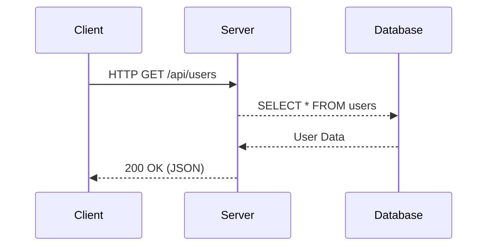

# 위키 링크 테스트

[[home|위키 링크]]를 더불어 [[home#컴퓨터 과학|헤더 링크]] 또한 지원합니다.  
[[#대제목 테스트 2|내부 링크]]도 정상적으로 지원합니다.

> [!warning] 주의!
> 단, `index.md` 파일은 url 경로가 빈 값으로 처리되기에 사용에 주의가 필요합니다.

# 이미지 업로드

이미지가 정상적으로 업로드 됩니다.
단, 이미지도 `/content` 폴더 내에 저장하세요.  

![[Pasted image 20260520020111.png]]

# 코드 블럭 테스트

코드 블럭이 정상적으로 작동하는지 확인합니다.

```java
System.out.println("Hello world!");
```

# 마크다운 테스트

==정상 작동시 해당 텍스트는 형광펜 강조 효과 또한 정상 작동합니다.==

아래 커스텀 인용 블럭이 정상 작동하는지 확인합니다.

> [!note] 참고
> 이것은 기본 노트 콜아웃입니다.

> [!warning] 주의!
> 에러가 발생할 수 있는 부분을 강조할 때 씁니다.

> [!tip]- 접기/펴기 팁
> 이렇게 뒤에 `-`를 붙이면 기본적으로 접혀있는 콜아웃을 만들 수 있습니다.

# 머메이드 다이어그램

머메이드 다이어그램이 정상 작동합니다.




# 수학 수식 (Math / LaTeX)

수학 공식 또한 정상 작동합니다.

인라인 수식 테스트: $O(n \log n)$ 

블록 수식 테스트:
$$
f(x) = \int_{-\infty}^\infty \hat f(\xi)\,e^{2 \pi i \xi x} \,d\xi
$$

# 태그

이 문서에 #obsidian 태그를 달아봅니다.

# 중첩목차 테스트

## 대제목 테스트 1
### 중제목 테스트 1.1
### 중제목 테스트 1.2
## 대제목 테스트 2

[[#위키 링크 테스트|위로]]

